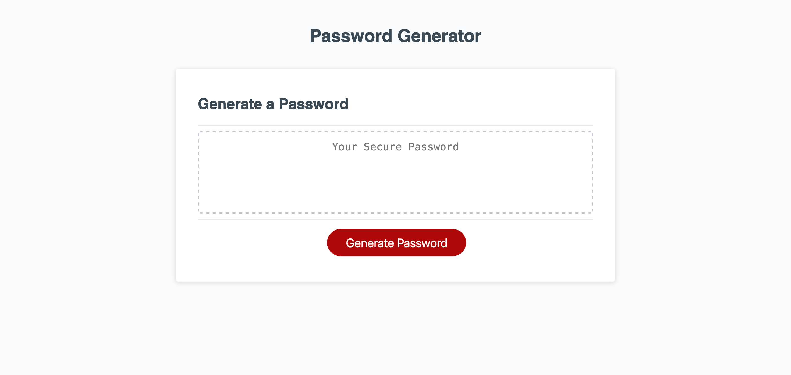

# Password-Generator

Generates a raddom password based on criteria selected.

## Description

This is an app that generates a random password based on criteria selected. It will run in the browser and use HTML and CSS created on the fly, with JavaScript being the cementing block, adding interactivity also. It will have a responsive user interface.

The password can include special characters.  

### The URL of the GitHub repository.

[Shirley Thompson's Password Generator on GitHub repository](https://github.com/shirleyama/Password-Generator)

### The URL of the functional, deployed application on GitHub Pages.

[Shirley Thompson's Password Generator](https://shirleyama.github.io/Password-Generator/)

## Installation

To access the website click [Shirley Thompson's Password Generator](https://shirleyama.github.io/Password-Generator/), the screenshot can be found below.

## Usage

## Credits

### Resources:

- [list of Password Special Characters from the OWASP Foundation](https://www.owasp.org/index.php/Password_special_characters)

- [Empty cells in Bootstrap grid](https://stackoverflow.com/questions/43171334/do-you-need-to-use-bootstraps-container-and-row-if-your-content-is-to-span/43172619#43172619)

- [When to use or not to use rows in Bootstrap](https://stackoverflow.com/questions/37079564/empty-content-in-bootstrap-grid-cell-causes-cell-to-not-render)

- [Grid layouts](https://getbootstrap.com/docs/4.3/layout/grid/)

- [HTML elements](https://developer.mozilla.org/en-US/docs/Web/HTML/Element)

- [Github](https://docs.github.com/en)

- [Semantic HTML](https://www.w3schools.com/html/html5_semantic_elements.asp)

- [Acceptance Criteria](https://www.altexsoft.com/blog/business/acceptance-criteria-purposes-formats-and-best-practices/)

Last but not the least and comes highly recommended

- [Frontend Web Bootcamp Course ](https://courses.bootcampspot.com/)

## License

The MIT License

## Tests

Tested in mobile and iPad viewports to see how it responds in these.

It would be great to test the website with the Mac screenreader VoiceOver to see how the website would appear to a visually impaired person, and whether it can be improved even further.

---
